* Table of Contents
{:toc}

--------------------------------------------------------------------------------------------------------------------

## **Acknowledgements**

* nerdTrackerPlus is based on the AddressBook-Level3 project created by the [SE-EDU initiative](https://se-education.org/)

* Github Co-pilot was used as an auto-complete tool by James Shen in most of his code.

--------------------------------------------------------------------------------------------------------------------

## **Setting up, getting started**

Refer to the guide [_Setting up and getting started_](SettingUp.md).

--------------------------------------------------------------------------------------------------------------------

## **Design**

:bulb: **Tip:** The `.puml` files used to create diagrams in this document `docs/diagrams` folder. Refer to the [_PlantUML Tutorial_ at se-edu/guides](https://se-education.org/guides/tutorials/plantUml.html) to learn how to create and edit diagrams.

### Architecture

The ***Architecture Diagram*** given above explains the high-level design of the App.

Given below is a quick overview of main components and how they interact with each other.

**Main components of the architecture**

**`Main`** (consisting of classes [`Main`](https://github.com/se-edu/addressbook-level3/tree/master/src/main/java/seedu/address/Main.java) and [`MainApp`](https://github.com/se-edu/addressbook-level3/tree/master/src/main/java/seedu/address/MainApp.java)) is in charge of the app launch and shut down.
* At app launch, it initializes the other components in the correct sequence, and connects them up with each other.
* At shut down, it shuts down the other components and invokes cleanup methods where necessary.

The bulk of the app's work is done by the following four components:

* [**`UI`**](#ui-component): The UI of the App.
* [**`Logic`**](#logic-component): The command executor.
* [**`Model`**](#model-component): Holds the data of the App in memory.
* [**`Storage`**](#storage-component): Reads data from, and writes data to, the hard disk.

[**`Commons`**](#common-classes) represents a collection of classes used by multiple other components.

**How the architecture components interact with each other**

The *Sequence Diagram* below shows how the components interact with each other for the scenario where the user issues the command `delete 1`.

Each of the four main components (also shown in the diagram above),

* defines its *API* in an `interface` with the same name as the Component.
* implements its functionality using a concrete `{Component Name}Manager` class (which follows the corresponding API `interface` mentioned in the previous point).

For example, the `Logic` component defines its API in the `Logic.java` interface and implements its functionality using the `LogicManager.java` class which follows the `Logic` interface. Other components interact with a given component through its interface rather than the concrete class (reason: to prevent outside component's being coupled to the implementation of a component), as illustrated in the (partial) class diagram below.

The sections below give more details of each component.

### UI component

The **API** of this component is specified in [`Ui.java`](https://github.com/se-edu/addressbook-level3/tree/master/src/main/java/seedu/address/ui/Ui.java)

The UI consists of a `MainWindow` that is made up of parts e.g.`CommandBox`, `ResultDisplay`, `PersonListPanel`, `StatusBarFooter` etc. All these, including the `MainWindow`, inherit from the abstract `UiPart` class which captures the commonalities between classes that represent parts of the visible GUI.

The `UI` component uses the JavaFx UI framework. The layout of these UI parts are defined in matching `.fxml` files that are in the `src/main/resources/view` folder. For example, the layout of the [`MainWindow`](https://github.com/se-edu/addressbook-level3/tree/master/src/main/java/seedu/address/ui/MainWindow.java) is specified in [`MainWindow.fxml`](https://github.com/se-edu/addressbook-level3/tree/master/src/main/resources/view/MainWindow.fxml)

The `UI` component,

* executes user commands using the `Logic` component.
* listens for changes to `Model` data so that the UI can be updated with the modified data.
* keeps a reference to the `Logic` component, because the `UI` relies on the `Logic` to execute commands.
* depends on some classes in the `Model` component, as it displays `Person` object residing in the `Model`.

### Logic component

**API** : [`Logic.java`](https://github.com/se-edu/addressbook-level3/tree/master/src/main/java/seedu/address/logic/Logic.java)

Here's a (partial) class diagram of the `Logic` component:

The sequence diagram below illustrates the interactions within the `Logic` component, taking `execute("delete 1")` API call as an example.

:information_source: **Note:** The lifeline for `DeleteCommandParser` should end at the destroy marker (X) but due to a limitation of PlantUML, the lifeline continues till the end of diagram.

How the `Logic` component works:

1. When `Logic` is called upon to execute a command, it is passed to an `AddressBookParser` object which in turn creates a parser that matches the command (e.g., `DeleteCommandParser`) and uses it to parse the command.
1. This results in a `Command` object (more precisely, an object of one of its subclasses e.g., `DeleteCommand`) which is executed by the `LogicManager`.
1. The command can communicate with the `Model` when it is executed (e.g. to delete a person). 
   Note that although this is shown as a single step in the diagram above (for simplicity), in the code it can take several interactions (between the command object and the `Model`) to achieve.
1. The result of the command execution is encapsulated as a `CommandResult` object which is returned back from `Logic`.

Here are the other classes in `Logic` (omitted from the class diagram above) that are used for parsing a user command:

How the parsing works:
* When called upon to parse a user command, the `AddressBookParser` class creates an `XYZCommandParser` (`XYZ` is a placeholder for the specific command name e.g., `AddCommandParser`) which uses the other classes shown above to parse the user command and create a `XYZCommand` object (e.g., `AddCommand`) which the `AddressBookParser` returns back as a `Command` object.
* All `XYZCommandParser` classes (e.g., `AddCommandParser`, `DeleteCommandParser`, ...) inherit from the `Parser` interface so that they can be treated similarly where possible e.g, during testing.

### Model component
**API** : [`Model.java`](https://github.com/se-edu/addressbook-level3/tree/master/src/main/java/seedu/address/model/Model.java)

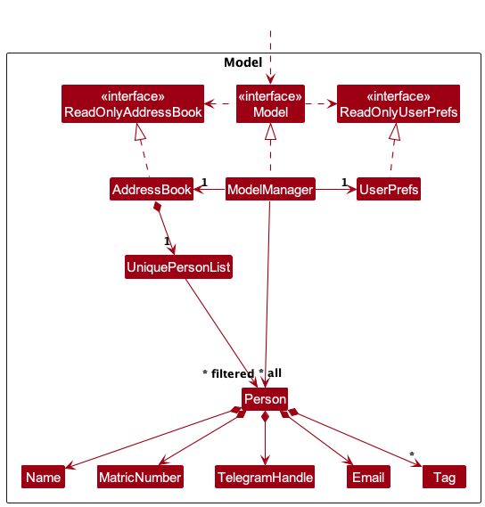

The `Model` component,

* stores the address book data i.e., all `Person` objects (which are contained in a `UniquePersonList` object).
* stores the currently 'selected' `Person` objects (e.g., results of a search query) as a separate _filtered_ list which is exposed to outsiders as an unmodifiable `ObservableList<Person>` that can be 'observed' e.g. the UI can be bound to this list so that the UI automatically updates when the data in the list change.
* stores a `UserPref` object that represents the user’s preferences. This is exposed to the outside as a `ReadOnlyUserPref` objects.
* does not depend on any of the other three components (as the `Model` represents data entities of the domain, they should make sense on their own without depending on other components)

:information_source: **Note:** An alternative (arguably, a more OOP) model is given below. It has a `Tag` list in the `AddressBook`, which `Person` references. This allows `AddressBook` to only require one `Tag` object per unique tag, instead of each `Person` needing their own `Tag` objects. 

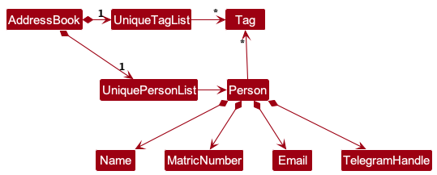

### Storage component

**API** : [`Storage.java`](https://github.com/se-edu/addressbook-level3/tree/master/src/main/java/seedu/address/storage/Storage.java)

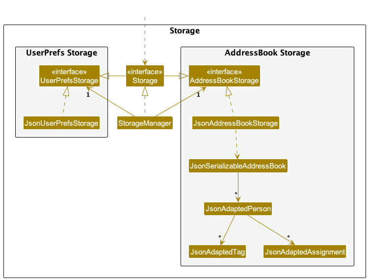

The `Storage` component,
* can save both address book data and user preference data in JSON format, and read them back into corresponding objects.
* inherits from both `AddressBookStorage` and `UserPrefStorage`, which means it can be treated as either one (if only the functionality of only one is needed).
* depends on some classes in the `Model` component (because the `Storage` component's job is to save/retrieve objects that belong to the `Model`)

### Common classes

Classes used by multiple components are in the `seedu.addressbook.commons` package.

--------------------------------------------------------------------------------------------------------------------

## **Implementation**

This section describes some noteworthy details on how certain features are implemented.

### Mark Participation feature

#### Implementation

The `markp` command allows users to mark the participation score of students for a particular week. It takes in an index representing the index of the person to mark in the list, as well as a week number representing the target week to mark.

To better understand how the mark command is executed, below is a sequence diagram to provide a visual representation.

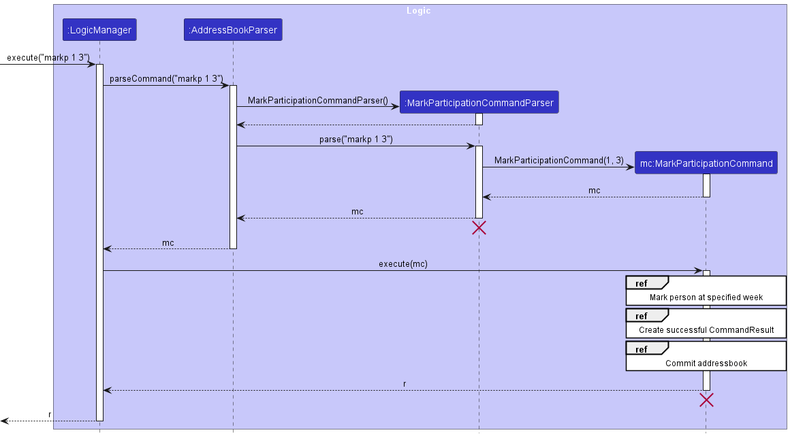

:information_source: **Note:** The lifeline for `MarkParticipationCommandParser` and `MarkParticipationCommand`should end at the destroy marker (X) but due to a limitation of PlantUML, the lifeline continues till the end of diagram.

The sequence diagrams below provide information for the respective reference frames.

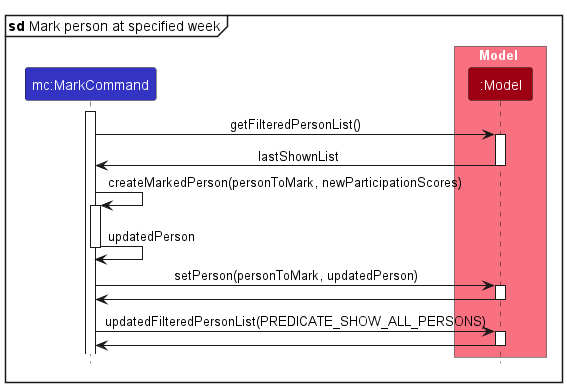

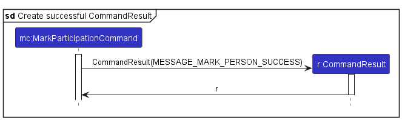

#### Design considerations

**Aspect: How to mark a student's participation score:**

* **Current implementation:** Creates a new person with updated participation scores.
    * Pros: Ensures immutability of each person object, which reduces the potential for unintended side effects caused by mutable state changes.
    * Cons: May incur some performance overhead since we are creating a new copy of a person each time the command is called.

* **Alternative:** Update the participation field of the existing person object.
    * Pros: Will use less memory since we are not recreating a person object.
    * Cons: Person become mutable, which might be challenging to test and ensure correctness as the state changes constantly.

### Filter feature

#### Implementation

The `filter` command allows users to filter the currently shown list of students based on tags that match any of the specified tags given with
the command. It takes in the `filter` keyword as well as one or more alphanumeric tags separated by a space.

To better understand how the filter command is executed, below is a sequence diagram to provide a visual representation.

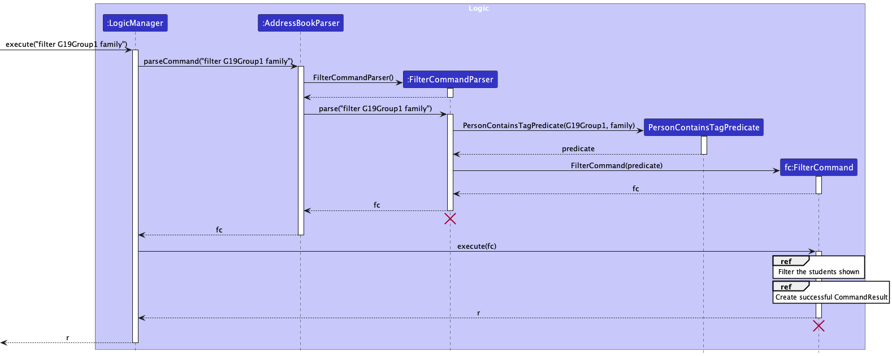

:information_source: **Note:** The lifeline for `FilterCommandParser` and `FilterCommand` should end at the destroy marker (X) but due to a limitation of PlantUML, the lifeline continues till the end of diagram.

The sequence diagrams below provide information for the respective reference frames.

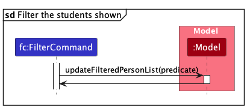

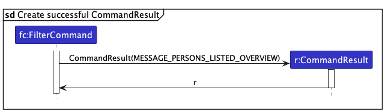

#### Design Consideration

**Aspect: How to filter the students shown by tag:**

* **Current implementation:** By using a PersonContainsTagPredicate, we update the filteredList in the Model which displays the students in the GUI.
    * Pros: Allows the filter command to use existing methods in the Model to filter the list of students. This reduces the negative side effects of the filter command.
    * Cons: The current implementation is dependent on the Model class and any bugs there renders the method useless.

* **Alternative:** By using a separate class to filter the students.
    * Pros: Reduces the dependency on the Model class and allows for easier testing of the filter command.
    * Cons: Requires additional classes to be created which may increase the complexity of the codebase.

### Grade Assignment feature

#### Implementation

The `grade` command allows users to assign a score to a particular student for a particular assignment. It takes in an index representing the index of the person to grade in the list, the name of the assignment to be graded, as well as a grade representing the grade to assign.

To better understand how the grade command is executed, below is a sequence diagram to provide a visual representation.

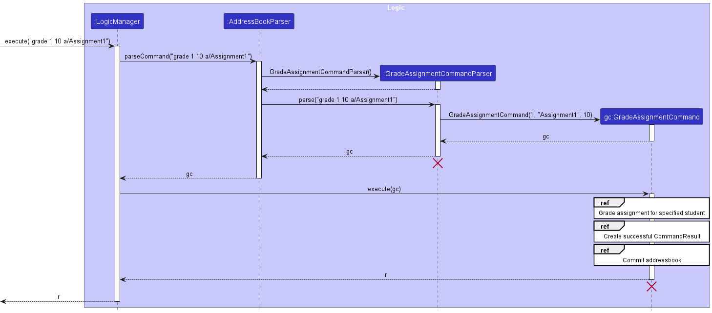

:information_source: **Note:** The lifeline for `GradeAssignmentCommandParser` and `GradeAssignmentCommand` should end at the destroy marker (X) but due to a limitation of PlantUML, the lifeline continues till the end of diagram.

The sequence diagrams below provide information for the respective reference frames.

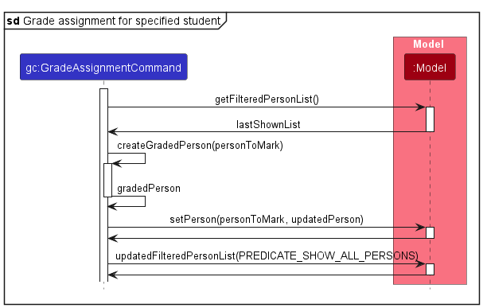

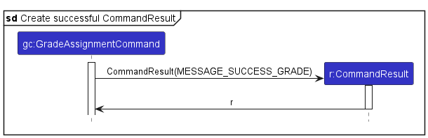

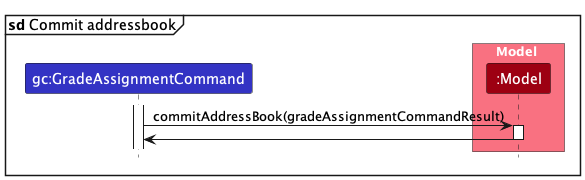

#### Design considerations

**Aspect: How to grade a student for a specific assignment:**

* **Current implementation:** Creates a new person with updated assignment grade.
    * Pros: Ensures immutability of each person object, which reduces the potential for unintended side effects caused by mutable state changes.
    * Cons: May incur some performance overhead since we are creating a new copy of a person each time the command is called.

* **Alternative:** Update the assignment field of the existing person object.
    * Pros: Will use less memory since we are not recreating a person object.
    * Cons: Person become mutable, which might be challenging to test and ensure correctness as the state changes constantly.

**Aspect: Range and state of grades that can be assigned for an assignment:**

* **Current implementation:** Grades are defaulted to 0 upon the creation of an assignment, and are displayed as yellow text boxes.
    * Pros: Allows for easy visual distinction between assignments with 0 and nonzero grades.
    * Cons: Does not allow for distinction between assignments with grade 0 and ungraded assignments.

* **Alternative:** Implement a new state for assignments: ungraded, displayed as red text boxes.
    * Pros: Will allow for distinction between assignments with grade 0 and ungraded assignments.
    * Cons: Requires additional work by users to assign grades to ungraded assignments, since there would no longer be a default grade of 0.

### Undo/redo feature

#### Implementation

The undo/redo mechanism is facilitated by `VersionedAddressBook`. It extends `AddressBook` with an undo/redo history, stored internally as an `addressBookStateList`, `commandResultList`, and `currentStatePointer`. Additionally, it implements the following operations:

* `VersionedAddressBook#commit()` — Saves the current address book state in its history.
* `VersionedAddressBook#commitInitial()` — Saves the initial address book state (upon initialisation) in its history.
* `VersionedAddressBook#undo()` — Restores the previous address book state from its history.
* `VersionedAddressBook#redo()` — Restores a previously undone address book state from its history.
* `VersionedAddressBook#getUndoneCommand()` — Fetches information about the command that was undone.
* `VersionedAddressBook#getRedoneCommand()` — Fetches information about the command that was redone.

These operations are exposed in the `Model` interface as `Model#commitAddressBook()`, `Model#undoAddressBook()`, `Model#redoAddressBook()`, `Model#getAddressBookUndoneCommand()`, and `Model#getAddressBookRedoneCommand()` respectively.

Given below is an example usage scenario and how the undo/redo mechanism behaves at each step.

Step 1. The user launches the application for the first time. The `VersionedAddressBook` will be initialized with the initial address book state, and the `currentStatePointer` pointing to that single address book state, saved with `VersionedAddressBook#commitInitial()`.

Step 2. The user executes `delete 5` command to delete the 5th person in the address book. The `delete` command calls `Model#commitAddressBook()`, causing the modified state of the address book after the `delete 5` command executes to be saved in the `addressBookStateList`, the `CommandResult` of the delete command to be saved in `commandResultList`, and the `currentStatePointer` is shifted to the newly inserted address book state.

Step 3. The user executes `add n/David …​` to add a new person. The `add` command also calls `Model#commitAddressBook()`, causing another modified address book state to be saved into the `addressBookStateList`.

:information_source: **Note:** If a command fails its execution, it will not call `Model#commitAddressBook()`, so the address book state will not be saved into the `addressBookStateList`. The command will also not be saved into `commandResultList`.

Step 4. The user now decides that adding the person was a mistake, and decides to undo that action by executing the `undo` command. The `undo` command will call `Model#undoAddressBook()`, which will shift the `currentStatePointer` once to the left, pointing it to the previous address book state, and restores the address book to that state.

:information_source: **Note:** If the `currentStatePointer` is at index 0, pointing to the initial AddressBook state, then there are no previous AddressBook states to restore. The `undo` command uses `Model#canUndoAddressBook()` to check if this is the case. If so, it will return an error to the user rather
than attempting to perform the undo.

The following sequence diagram shows how an undo operation goes through the `Logic` component:

:information_source: **Note:** The lifeline for `UndoCommand` should end at the destroy marker (X) but due to a limitation of PlantUML, the lifeline reaches the end of diagram.

Similarly, how an undo operation goes through the `Model` component is shown below:

The `redo` command does the opposite — it calls `Model#redoAddressBook()`, which shifts the `currentStatePointer` once to the right, pointing to the previously undone state, and restores the address book to that state. It also returns information about the redone command through `Model#getAddressBookRedoneCommand()`.

:information_source: **Note:** If the `currentStatePointer` is at index `addressBookStateList.size() - 1`, pointing to the latest address book state, then there are no undone AddressBook states to restore. The `redo` command uses `Model#canRedoAddressBook()` to check if this is the case. If so, it will return an error to the user rather than attempting to perform the redo.

Step 5. The user then decides to execute the command `list`. Commands that do not modify the address book, such as `list`, will not call `Model#commitAddressBook()`, `Model#undoAddressBook()`, or `Model#redoAddressBook()`. Thus, the `addressBookStateList` remains unchanged.

Step 6. The user executes `clear`, which calls `Model#commitAddressBook()`. Since the `currentStatePointer` is not pointing at the end of the `addressBookStateList`, all address book states after the `currentStatePointer` will be purged. This is determined by calling `VersionedAddressBook#shouldPurge()`, and if there are future state to be purged, `VersionedAddressBook#purge()` will be called.

Reason: It no longer makes sense to redo the `add n/David …​` command. This is the behavior that most modern desktop applications follow.

The following activity diagram summarizes what happens when a user executes a new command:

#### Design considerations:

**Aspect: How undo & redo executes:**

* **Current implementation:** Saves the entire address book.
  * Pros: Easy to implement.
  * Cons: May have performance issues in terms of memory usage.

* **Alternative:** Individual command knows how to undo/redo by
  itself.
  * Pros: Will use less memory (e.g. for `delete`, just save the person being deleted).
  * Cons: We must ensure that the implementation of each individual command are correct.

### Add Assignment Feature

#### Implementation
The Add Assignment feature allows users to add assignments to users in nerdTrackerPlus. An Assignment is represented by
the Assignment class, which contains the assignment name and score. The command takes in a list of assignment
names then creates and adds a list of those assignments to the Assignment list of all users that do not already
have an assignment with the same name. The assignments are initiated with a score of 0 and saved to the storage file.

To better understand how the add assignment command is executed, below is a sequence diagram to provide a visual representation.

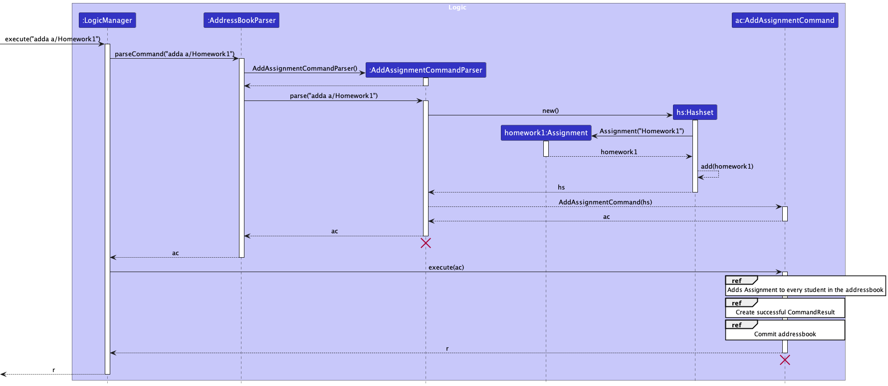

:information_source: **Note:** The lifeline for `AddAssignmentCommandParser` and `AddAssignmentCommand` should end at the destroy marker (X) but due to a limitation of PlantUML, the lifeline continues till the end of diagram.

The sequence diagrams below provide information for the respective reference frames.

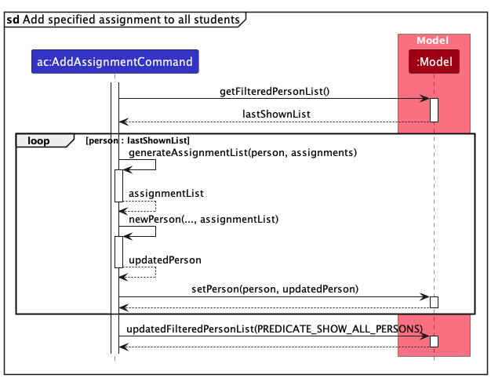

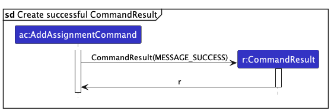

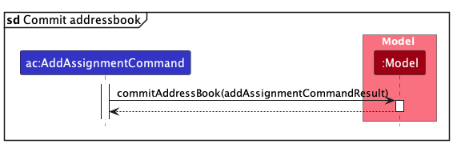

#### Design considerations

**Aspect: How to add assignments to students:**

* **Current implementation:** Creates a new person with updated assignment list.
    * Pros: Ensures immutability of each person object, which reduces the potential for unintended side effects caused by mutable state changes.
    * Cons: May incur some performance overhead since we are creating a new copy of a person each time the command is called.
    * Cons: May have performance issues in terms of memory usage.
* **Alternative:** Update the assignment list of the existing person object.
    * Pros: Will use less memory since we are not recreating a person object.
    * Cons: Person becomes mutable, which might be challenging to test and ensure correctness as the state changes constantly.

**Aspect: How to handle duplicate Assignments:**

* **Current implementation:** Checks if the assignment already exists in the person's assignment list.
Adds the assignment if it does not exist. Duplicates are ignored as long as one person on the list does not have the assignment.
    * Pros: Ensures that duplicate assignments are not added to the person's assignment list.
    * Cons: Does not tell user which are ignored.

* **Alternative:** Checks if the duplicates exists in each person's assignment list, prompt user to confirm if they want to add the assignment.
    * Pros: Ensures that the user is aware of the duplicates and can decide if they want to add the assignment.
    * Cons: May be cumbersome for the user if they have many duplicates and have large student list.

--------------------------------------------------------------------------------------------------------------------

## **Documentation, logging, testing, configuration, dev-ops**

* [Documentation guide](Documentation.md)
* [Testing guide](Testing.md)
* [Logging guide](Logging.md)
* [Configuration guide](Configuration.md)
* [DevOps guide](DevOps.md)

--------------------------------------------------------------------------------------------------------------------

## **Appendix: Requirements**

### Product scope

**Target user profile**:

* Has a need to manage a significant number students from tutorial classes
* Prefer desktop apps over other types
* Can type fast
* Prefers typing to mouse interactions
* Is reasonably comfortable using CLI apps

**Value proposition**:

nerdTrackerPlus helps Computer Science TAs manage students contacts through a CLI interface, which is much faster than a typical mouse/GUI driven app.

### User stories

Priorities: High (must have) - `* * *`, Medium (nice to have) - `* *`, Low (unlikely to have) - `*`

| Priority | As a …​                | I want to …​                                                     | So that I can…​                                                                               |
|----------|------------------------|------------------------------------------------------------------|-----------------------------------------------------------------------------------------------|
| `* * *`  | new user               | see usage instructions                                           | refer to instructions when I forget how to use the App                                        |
| `* * *`  | CS2109S teaching staff | add a new student                                                | keep track of their contact details                                                           |
| `* * *`  | CS2109S teaching staff | delete a student                                                 | remove student entries that I no longer need                                                  |
| `* * *`  | CS2109S teaching staff | list students                                                    | view all students currently in my contacts                                                    |
| `* * *`  | CS2109S teaching staff | find a student by name                                           | locate details of students without having to go through the entire list                       |
| `* * *`  | CS2109S teaching staff | edit student details                                             | ensure that student details are always updated                                                |
| `* * *`  | CS2109S teaching staff | filter students by tag                                           | make it easier to search for students in a specific module or class                           |
| `* * *`  | CS2109S teaching staff | add tags to students                                             | categorize student contacts for reference                                                     |
| `* * *`  | CS2109S teaching staff | delete tags from students                                        | remove tags from students that do not belong to that category                                 |
| `* * *`  | CS2109S teaching staff | mark the attendance for a student for a specific week            | so that I can keep track of their tutorial attendance over the course of the module           |
| `* * *`  | CS2109S teaching staff | mark the participation score for a student for a specific week   | so that I can keep track of their tutorial participation scores over the course of the module |
| `* * *`  | CS2109S teaching staff | mark the attendance for all students for a specific week         | so that I can easily mark the attendance of a tutorial class                                  |
| `* * *`  | CS2109S teaching staff | mark the participation score for all student for a specific week | so that I can easily mark the participation of the entire tutorial class                      |
| `* * *`  | CS2109S teaching staff | unmark the attendance for a student for a specific week          | so that I can correct myself in case attendance was marked wrongly                            |
| `* * *`  | CS2109S teaching staff | unmark the participation score for a student for a specific week | so that I can correct myself in case participation scores were marked wrongly                 |
| `* * *`  | CS2109S teaching staff | add assignments based on my course's assessment structure        | so that I can keep track of my student's assignments                                          |
| `* * *`  | CS2109S teaching staff | remove assignments                                               | so that I can remove assignments that were added by mistake                                   |
| `* * *`  | CS2109S teaching staff | grade assignments that were added                                | so that I can keep track of the grades that my students received for the various assignments  |
| `* *`    | CS2109S teaching staff | undo a previously issued command                                 | so that it is convenient to undo any mistakes made                                            |
| `* *`    | CS2109S teaching staff | redo a previously undone command                                 | so that I can restore the last changes that were undone                                       |
| `* * *`  | user                   | close and exit the app                                           |                                                                                               |

### Use cases

(For all use cases below, the **System** is `nerdTrackerPlus` and the **Actor** is the `user`, unless specified otherwise)

---

**Use case UC01: Adding a student**

***Main Success Scenario (MSS)***
1. User request to add student.
2. nerdTrackerPlus adds the students with the relevant particulars.

    Use case ends.

***Extensions***
* 1a. User inputs invalid particulars/is missing some particulars.
  * 1a1. nerdTrackerPlus shows an error message indicating invalid input.

    Use case resumes at step 2.

---

**Use case UC02: List students**

***MSS***
1. User requests to list students.
2. nerdTrackerPlus shows a list of students.

   Use case ends.

---

**Use case UC03: Edit student details**

***MSS***
1. User requests to list students.
2. nerdTrackerPlus shows a list of students.
3. User request to edit certain details of a specific student.
4. nerdTrackerPlus successfully edits student's details.

   Use case ends.

***Extensions***
* 1a. The list is empty.

  Use case ends.

* 3a. User inputs invalid index or student particulars.
    * 3a1. nerdTrackerPlus shows an error message indicating invalid index/student particulars.

    Use case ends.

---

**Use case UC04: Find student**

***MSS***
1. User requests to search for a specific student/students in the contacts list by name.
2. nerdTrackerPlus shows all students in the list with the matching name.

   Use case ends.

***Extensions***
* 1a. User searches with invalid input.
    * 1a1. nerdTrackerPlus shows an error message indicating invalid search input.

      Use case resumes at step 1.

---

**Use case UC05: Delete a student**

***MSS***
1. User requests to list students.
2. nerdTrackerPlus shows a list of students.
3. User requests to delete a specific student in the list.
4. nerdTrackerPlus deletes the student.

    Use case ends.

***Extensions***
* 2a. The list is empty.

  Use case ends.

* 3a. User inputs invalid index.
    * 3a1. nerdTrackerPlus shows an error message indicating invalid index for deletion.

      Use case resumes at step 2.

---
**Use case UC06: Remove tag from individual student**

***Precondition***: User has added a tag(s) to the specified student.

***MSS***

1. User requests to list students.
2. nerdTrackerPlus shows a list of students.
3. User requests to remove a specific tag(s) from a specific student.
4. nerdTrackerPlus successfully removes the specified tag(s) from that student.

   Use case ends.

***Extensions***

* 1a. The list is empty.

  Use case ends.

* 3a. User inputs invalid index or tag.
    * 3a1. nerdTrackerPlus shows an error message indicating invalid index or tag.

        Use case resumes at step 2.

* 3b. User inputs tag that does not exist on the student.
    * 3b1. nerdTrackerPlus shows an error message indicating that the specified student does not have the specified tag.

        Use case resumes at step 2.

**Use case UC07: Remove tag from all students**

***Precondition***: User has added a tag(s) to all students.

***MSS***

1. User requests to list students.
2. nerdTrackerPlus shows a list of students.
3. User requests to remove a specific tag(s) from all students.
4. nerdTrackerPlus successfully removes the specified tag(s) from all students who have that tag.

   Use case ends.

***Extensions***

* 1a. The list is empty.

  Use case ends.

* 3a. User inputs invalid index or tag.
    * 3a1. nerdTrackerPlus shows an error message indicating invalid index or tag.

    Use case resumes at step 2.

* 3b. User inputs tag that does not exist on any student.
    * 3b1. nerdTrackerPlus shows an error message indicating that the specified tag does not exist on any student.

    Use case resumes at step 2.

---

**Use case UC08: Filter students by tag**

***MSS***
1. User requests to filter students by a specific tag(s).
2. nerdTrackerPlus filters the list of students based on the specified tag(s).
3. nerdTrackerPlus displays the filtered list of students.

   Use case ends.

***Extensions***

* 1a. No students match the specified tag.
    * 1a1. nerdTrackerPlus shows an error message indicating no students match the specified tag.

      Use case ends.

* 1b. Invalid tag input.
    * 1b1. nerdTrackerPlus shows an error message indicating invalid tag input.

      Use case resumes at step 1.

---

**Use case UC09: Mark individual participation score for a student**

***MSS***

1. User requests to list students/filter students by a specific tag.
2. nerdTrackerPlus shows a (filtered) list of students.
3. User requests to mark the participation score of a specific student in a specific week.
4. nerdTrackerPlus successfully marks the student's participation score.

   Use case ends.

***Extensions***

* 1a. The list is empty.

    Use case ends.

* 1b. No students match the specified tag.
    * 1b1. nerdTrackerPlus shows an error message indicating no students match the specified tag.

    Use case ends.

* 3a. User inputs invalid index or week number.
    * 3a1. nerdTrackerPlus shows an error message indicating invalid index or week number.

    Use case resumes at step 3.

* 3b. User inputs invalid participation score.
    * 3b1. nerdTrackerPlus shows an error message indicating invalid participation score.

    Use case resumes at step 3.

---

**Use case UC10: Unmark individual participation score for a student**

***Precondition***: User has marked participation for the specified student.

***MSS***

1. User requests to list students/filter students by a specific tag.
2. nerdTrackerPlus shows a (filtered) list of students.
3. User requests to unmark the participation score of a specific student in a specific week.
4. nerdTrackerPlus successfully unmarks the student's participation score.

   Use case ends.

***Extensions***

* 1a. The list is empty.

    Use case ends.

* 1b. No students match the specified tag.
    * 1b1. nerdTrackerPlus shows an error message indicating no students match the specified tag.

    Use case ends.

* 3a. User inputs invalid index or week number.
    * 3a1. nerdTrackerPlus shows an error message indicating invalid index or week number.

    Use case resumes at step 3.

* 3b. User inputs invalid participation score.
    * 3b1. nerdTrackerPlus shows an error message indicating invalid participation score.

    Use case resumes at step 3.

* 3c. User tries to unmark a student's participation score that has not been marked.
    * 3c1. nerdTrackerPlus shows an error message indicating that the student's participation score has not been marked.

    Use case resumes at step 3.

---

**Use case UC11: Mark individual attendance for a student**

***MSS***

1. User requests to list students/filter students by a specific tag.
2. nerdTrackerPlus shows a (filtered) list of students.
3. User requests to mark the attendance of a specific student in a specific week.
4. nerdTrackerPlus successfully marks the student's attendance.

   Use case ends.

***Extensions***

* 1a. The list is empty.

    Use case ends.

* 1b. No students match the specified tag.
    * 1b1. nerdTrackerPlus shows an error message indicating no students match the specified tag.

    Use case ends.

* 3a. User inputs invalid index or week number.
    * 3a1. nerdTrackerPlus shows an error message indicating invalid index or week number.

    Use case resumes at step 3.

---

**Use case UC12: Unmark individual attendance for a student**

***Precondition***: User has marked attendance for the specified student.

***MSS***

1. User requests to list students/filter students by a specific tag.
2. nerdTrackerPlus shows a (filtered) list of students.
3. User requests to unmark the attendance of a specific student in a specific week.
4. nerdTrackerPlus successfully unmarks the student's attendance.

   Use case ends.

***Extensions***

* 1a. The list is empty.

    Use case ends.

* 1b. No students match the specified tag.
    * 1b1. nerdTrackerPlus shows an error message indicating no students match the specified tag.

    Use case ends.

* 3a. User inputs invalid index or week number.
    * 3a1. nerdTrackerPlus shows an error message indicating invalid index or week number.

    Use case resumes at step 3.

* 3b. User inputs invalid participation score.
    * 3b1. nerdTrackerPlus shows an error message indicating invalid participation score.

    Use case resumes at step 3.

* 3c. User tries to unmark a student's attendance that has not been marked.
    * 3c1. nerdTrackerPlus shows an error message indicating that the student's attendance has not been marked.

    Use case resumes at step 3.

---

**Use case UC13: Mark all participation scores for all students**

***MSS***

1. User requests to list students/filter students by a specific tag.
2. nerdTrackerPlus shows a (filtered) list of students.
3. User requests to mark all students' participation scores for a specific week.
4. nerdTrackerPlus marks the participation score for all students for the specified week.

   Use case ends.

***Extensions***

* 1a. The list is empty.

    Use case ends.

* 1b. No students match the specified tag.
    * 1b1. nerdTrackerPlus shows an error message indicating no students match the specified tag.

    Use case ends.

* 2a. The specified week is invalid.
    * 2a1. nerdTrackerPlus shows an error message indicating an invalid week.

    Use case ends.

---

**Use case UC14: Unmark all participation scores for all students**

***Precondition***: User has marked participation for all students.

***MSS***

1. User requests to list students/filter students by a specific tag.
2. nerdTrackerPlus shows a (filtered) list of students.
3. User requests to unmark all students' participation scores for a specific week.
4. nerdTrackerPlus unmarks the participation score for all students for the specified week.

   Use case ends.

***Extensions***

* 1a. The list is empty.

    Use case ends.

* 1b. No students match the specified tag.
    * 1b1. nerdTrackerPlus shows an error message indicating no students match the specified tag.

    Use case ends.

* 2a. The specified week is invalid.
    * 2a1. nerdTrackerPlus shows an error message indicating an invalid week.

    Use case ends.

* 2b. 1 or more students in the filtered list has participation score equal to 0 for the specified week.
  * 2b1. nerdTrackerPlus shows an error message indicating that the participation score for 1 or more students is already 0 for the specified week.

    Use case ends.

---

**Use case UC15: Mark all attendance for all students**

***MSS***

1. User requests to list students/filter students by a specific tag.
2. nerdTrackerPlus shows a (filtered) list of students.
3. User requests to mark all students' attendance for a specific week.
4. nerdTrackerPlus marks the attendance for all students for the specified week.

   Use case ends.

***Extensions***

* 1a. The list is empty.

    Use case ends.

* 1b. No students match the specified tag.
    * 1b1. nerdTrackerPlus shows an error message indicating no students match the specified tag.

    Use case ends.

* 2a. The specified week is invalid.
    * 2a1. nerdTrackerPlus shows an error message indicating an invalid week.

    Use case ends.

---

**Use case UC16: Unmark all attendance for all students**

***Precondition***: User has marked attendance for all students.

***MSS***

1. User requests to list students/filter students by a specific tag.
2. nerdTrackerPlus shows a (filtered) list of students.
3. User requests to unmark all students' attendance for a specific week.
4. nerdTrackerPlus unmarks the attendance for all students for the specified week.

   Use case ends.

***Extensions***

* 1a. The list is empty.

    Use case ends.

* 1b. No students match the specified tag.
    * 1b1. nerdTrackerPlus shows an error message indicating no students match the specified tag.

    Use case ends.

* 2a. The specified week is invalid.
    * 2a1. nerdTrackerPlus shows an error message indicating an invalid week.

    Use case ends.

* 2b. 1 or more students in the filtered list has attendance equal to 0 for the specified week.
    * 2b1. nerdTrackerPlus shows an error message indicating that the attendance for 1 or more students is already 0 for the specified week.

    Use case ends.

---

**Use case UC17: Add assignment for all students**

***MSS***

1. User requests to list students/filter students by a specific tag.
2. nerdTrackerPlus shows a (filtered) list of students.
3. User requests to add a new assignment with specific details.
4. nerdTrackerPlus adds the assignment with the specified details to the filtered.

   Use case ends.

***Extensions***

* 1a. The list is empty.

    Use case ends.

* 1b. No students match the specified tag.
    * 1b1. nerdTrackerPlus shows an error message indicating no students match the specified tag.

    Use case ends.

* 2a. User provides incomplete or invalid details for the assignment.
    * 2a1. nerdTrackerPlus shows an error message indicating the incomplete or invalid details.

    Use case resumes at step 1.

* 2b. User attempts to add assignment that already exists for all students.
    * 2b1. nerdTrackerPlus shows an error message indicating that the assignment already exists for all students.

    Use case resumes at step 1.

---

**Use case UC18: Remove assignment for all students**

***Precondition***: User has added an assignment for at least 1 student.

***MSS***

1. User requests to remove a specific assignment from all students.
2. nerdTrackerPlus removes the assignment from all students.

   Use case ends.

***Extensions***

* 1a. The specified assignment does not exist on any student.
    * 1a1. nerdTrackerPlus displays a message indicating that the assignment does not exist on any student.

    Use case resumes at step 1.

---

**Use case UC19: Grade assignment for a student**

***Precondition***: User has added an assignment for the specified student.

***MSS***

1. User requests to grade a specific assignment for a specific student with a specific score.
2. nerdTrackerPlus assigns the specified score for the specified assignment to the specified student.

   Use case ends.

***Extensions***

* 1a. The specified assignment or student does not exist.
    * 1a1. nerdTrackerPlus shows an error message indicating an invalid assignment or student.

    Use case resumes at step 1.

* 2a. The provided grade is invalid.
    * 2a1. nerdTrackerPlus shows an error message indicating an invalid grade input.

    Use case resumes at step 1.

---

**Use case UC20: View help**

***MSS***

1. User requests to view help.
2. nerdTrackerPlus shows a link to the nerdTrackerPlus User Guide.

   Use case ends.

---

**Use case UC21: Undo a previously issued command**

***Precondition***: User has issued a command that can be undone (changed data).

***MSS***

1. User requests to undo the previously issued command.
2. nerdTrackerPlus undoes the previously issued command.
3. nerdTrackerPlus shows a message indicating the command that was undone.

   Use case ends.

***Extensions***

* 1a. There is no command to undo.
    * 1a1. nerdTrackerPlus shows an error message.

  Use case ends.

---

**Use case UC22: Redo a previously undone command**

***Precondition***: User has undone at least 1 command immediately prior.

***MSS***

1. User requests to redo the previously undone command.
2. nerdTrackerPlus redoes the previously undone command.
3. nerdTrackerPlus shows a message indicating the command that was redone.

   Use case ends.

***Extensions***

* 1a. There is no command to redo.
    * 1a1. nerdTrackerPlus shows an error message.

  Use case ends.

---

**Use case UC23: Clear all students**

***MSS***

1. User requests to clear all students.
2. nerdTrackerPlus clears all students from the list.

   Use case ends.

---

**Use case UC24: Exit nerdTrackerPlus**

***MSS***

1. User requests to exit nerdTrackerPlus.
2. nerdTrackerPlus exits.

   Use case ends.

---

### Non-Functional Requirements

1.  Should work on any _mainstream OS_ as long as it has Java `11` or above installed.
2.  Should be able to hold up to 1000 persons without a noticeable sluggishness in performance for typical usage.
3.  A user with above average typing speed for regular English text (i.e. not code, not system admin commands) should be able to accomplish most of the tasks faster using commands than using the mouse.
4. The commands should be clear and concise that are easy for teaching assistants to understand and use without extensive training.
5. The application should only be designed for a single user.
6. The application should respond promptly to user inputs, with minimal latency between command execution and feedback.

### Glossary

* **Mainstream OS**: Windows, Linux, Unix, macOS
* **Private contact detail**: A contact detail that is not meant to be shared with others
* **API**: Application Programming Interface, a set of rules, protocols, and tools that allows different software applications to communicate with each other.
* **GUI**: Graphical User Interface, a type of user interface that allows users to interact with a computer system using graphical elements on the screen such as windows, icons, menus, and buttons.
* **CLI**: Command Line Interface, a text based interface used to interact with computer programs and operating systems by typing commands into a terminal or command prompt.
* **MSS**: Main Success Scenario, a sequence of events or steps that occur when a system or software application operates as intended, without any errors or exceptions.
* **JSON**: JavaScript Object Notation, a lightweight data interchange format used for transmitting structured data between systems in a human-readable and machine-parseable way.

--------------------------------------------------------------------------------------------------------------------

## **Appendix: Instructions for manual testing**

Given below are instructions to test the app manually.

The commands are used based on the default sample data that is generated by nerdTrackerPlus upon launch.

:information_source: **Note:** These instructions only provide a starting point for testers to work on;
testers are expected to do more *exploratory* testing.

### Launch and shutdown

1. Initial launch

    1. Download `nerdTrackerPlus.jar` and copy into an empty folder

    2. Double-click the jar file or run `java -jar nerdTrackerPlus.jar`.   Expected: Shows the GUI with a set of sample contacts. The window size may not be optimum.

2. Saving window preferences

    1. Resize the window to an optimum size. Move the window to a different location. Close the window.

    2. Re-launch the app by double-clicking the jar file or running `java -jar nerdTrackerPlus.jar` .  Expected: The most recent window size and location is retained.

3. Closing the app using the `exit` command

    1. Type the command `exit` into the command line and hit enter.   Expected: The app window closes.

4. Closing the app by clicking on the close button

    1. Click the close button on the top right hand corner of the app window.   Expected: The app window closes.

### Adding a student

1. Adding a student to nerdTrackerPlus

    1. Test case: `add n/Bob Lee e/boblee@u.nus.edu m/A1234567A tl/bobthelee69 t/CS2109S`  
       Expected: If there is no student named Bob Lee currently in nerdTrackerPlus, Bob Lee will be added with the corresponding details. Otherwise, an error message will be shown.

    2. Test case: `add n/Danielle Marsh e/daniellemarsh@u.nus.edu m/A9876543Z tl/danimarsh12`  
       Expected: If there is no student named Danielle Marsh currently in nerdTrackerPlus, Danielle Marsh will be added to nerdTrackerPlus with the corresponding details. Otherwise, an error message will be shown.

    3. Incorrect test cases to try: `add`, `add n/Danielle`, `add n/Danielle* e/dani@u.nus.edu tl/danimarsh12 m/A9876543Z`, `add n/Danielle* e/dani@u.nus.edu tl/danimarsh12`..., where one or more compulsory fields are missing, incorrect command format etc.  
       Expected: No student is added. Error message is shown.

### Listing students

1. Listing students in nerdTrackerPlus

    1. Prerequisites: All students in nerdTrackerPlus is already shown.

    2. Test case: `list`  
       Expected: No change to current list

2. Listing all students when the list is currently filtered

    1. Prerequisites: Some students are already filtered out using the `filter` or `find` command.

    2. Test case: `list`  
       Expected: Current list shows all students in nerdTrackerPlus (including ones that were previously filtered out).

### Editing a student

1. Editing student details in nerdTrackerPlus

    1. Prerequisites: Student already exist in nerdTrackerPlus

    2. Test case: `edit 1 n/Adam Lee`  
       Expected: If there is no student already named Adam Lee in nerdTrackerPlus, the first student in the list will be renamed to `Adam Lee`. Otherwise, an error message will be shown.

    3. Test case: `edit 1 n/Adam Lee tl/adamlee01`  
       Expected: If there is no student already named Adam Lee in nerdTrackerPlus, the first student in the list will be renamed to `Adam Lee` and his telegram handle will be changed to `adamlee01`. Otherwise, an error message will be shown.

    4. Incorrect test cases to try: `edit`, `edit 0`, `edit 1 n/Adam*`.  
       Expected: Edit command is not executed. Error message is shown.

### Finding students

1. Finding students in nerdTrackerPlus

    1. Prerequisites: nerdTrackerPlus contains some students.

    2. Test case: `find charlotte`  
       Expected: If there is no student named `charlotte`, there will be no students displayed. Otherwise, students whose names contain `charlotte` will be displayed.

    3. Incorrect test cases to try: `find`  
       Expected: `find` command is not executed. Error message is shown.

### Filtering students

1. Filtering students in nerdTrackerPlus

    1. Prerequisites: nerdTrackerPlus contains some students.

    2. Test case: `filter CS2109S`  
       Expected: If there are no students with the tag `CS2109S`, there will be no students displayed. Otherwise, students with the tag `CS2109S` will be displayed.

    3. Incorrect test cases to try: `filter`  
       Expected: `filter` command is not executed. Error message is shown.

### Deleting a student

1. Deleting a student while all students are being shown

    1. Prerequisites: List all students using the `list` command. Multiple students in the list.

    2. Test case: `delete 1`  
      Expected: First contact is deleted from the list. Details of the deleted contact shown in the status message.

    3. Incorrect test cases to try: `delete`, `delete 0`, `delete x` (where x is larger than the number of students in the list)  
      Expected: No person is deleted. Error details shown in the status message.

### Removing tag from a specific student

1. Removing a tag from a student

    1. Prerequisites: Tag to remove exists on student.

    2. Test case: `removetag 1 t/CS2109S`  
      Expected: If the tag `CS2109S` exists on the first student in the list, the tag will be successfully removed. Otherwise, no tag is removed and an error message is shown.

    3. Incorrect test cases to try: `removetag`, `removetag 0`, `removetag x` (where x is larger than the number of students in the list)  
      Expected: `removetag` command is not executed. Error message is shown.

### Removing tag(s) from all students

1. Remove tag(s) from all students

    1. Prerequisites: Tag(s) to remove exists on students.

    2. Test case: `removetagall t/CS2109S`  
       Expected: If the tag `CS2109S` exists on at least 1 student in the list, the tag will be successfully removed. Otherwise, no tag is removed and an error message is shown.

    3. Incorrect test cases to try: `removetagall`, `removetagall CS2109S`, `removetagall t/CS2109S*`  
       Expected: `removetagall` command is not executed. Error message is shown.

### Marking / Un-marking participation

1. Marking / Un-marking the participation score of a student for a specific week

    1. Prerequisites: nerdTrackerPlus contains some students.

    2. Test case: `markp 1 3`  
       Expected: Participation score of the first student in the list is incremented by 1 for week 3.

    3. Test case: `unmarkp 1 3`  
       Expected: If the participation score of the first student in the list is greater than 0, it will be decremented by 1. Otherwise, score is not decremented and an error message is shown

    4. Incorrect test cases to try: `markp`, `unmarkp`, `markp 0 3`, `unmarkp 1 14`, where the `INDEX` or `WEEK_NUMBER` is not within the valid range.  
       Expected: Participation score is not marked / unmarked. Error message is shown.

### Marking / Un-marking participation for all students

1. Marking / Un-marking the participation score of all shown students for a specific week

   1. Prerequisites: nerdTrackerPlus contains some students.

   2. Test case: `markallp 3`  
      Expected: Participation score of all students (filtered students if filter command was applied) in the list is incremented by 1 for week 3.

   3. Test case: `unmarkallp 3`  
      Expected: If the participation score of all students (filtered students if filter command was applied) in the list is greater than 0, it will be decremented by 1 for week 3.

   4. Incorrect test cases to try: `markallp`, `unmarkallp`, `markallp 0`, `unmarkallp 0`, `markallp 14`, `unmarkallp 14`, where the `WEEK_NUMBER` is not within the valid range.  
      Expected: Participation score is not marked. Error message is shown.

### Marking / Un-marking attendance

1. Marking / Un-marking the attendance of a student for a specific week

    1. Prerequisites: nerdTrackerPlus contains some students.

    2. Test case: `marka 1 3`  
       Expected: Attendance of the first student in the list is marked for week 3.

    3. Test case: `unmarka 1 3`  
       Expected: Attendance of the first student in the list is unmarked for week 3.

    4. Incorrect test cases to try: `marka`, `unmarka`, `marka 0 3`, `unmarka 1 14`, where the `INDEX` or `WEEK_NUMBER` is not within the valid range.  
       Expected: Attendance is not marked / unmarked. Error message is shown.

### Marking / Un-marking attendance for all students

1. Marking / Un-marking the attendance of all shown students for a specific week

    1. Prerequisites: nerdTrackerPlus contains some students.

    2. Test case: `markalla 3`  
       Expected: Attendance of all students (filtered students if filter command was applied) in the list is marked for week 3.

    3. Test case: `unmarkalla 3`  
       Expected: Attendance of all students (filtered students if filter command was applied) in the list is unmarked for week 3.

    4. Incorrect test cases to try: `markalla`, `unmarkalla`, `markalla 0`, `unmarkalla 0`, `markalla 14`, `unmarkalla 14` where the `WEEK_NUMBER` is not within the valid range.  
       Expected: Attendance is not marked. Error message is shown.

### Adding an assignment

1. Adding an assignment to all students in the list.

    1. Prerequisites: nerdTrackerPlus contains some students.

    2. Test case: `adda a/assignment1`  
       Expected: If at least 1 student does not have `assignment1`, it is added to those students in the list. Otherwise, no assignments are added and an error message is shown.

    3. Test case: `adda a/assignment1 a/assignment2`  
       Expected: If at least 1 student does not have `assignment1` or `assignment2`, the missing assignment is added to those students in the list. Otherwise, no assignments are added and an error message is shown.

    4. Incorrect test cases to try: `adda`, `adda a/assignment1*`, `adda assignment1`...  
       Expected: No new assignments are added. Error message is shown.

### Removing an assignment

1. Remove an assignment from all students in the list.

    1. Prerequisites: nerdTrackerPlus contains some students that have some assignments.

    2. Test case: `removea a/assignment1`  
       Expected: If at least 1 student has `assignment1`, then it is removed from all students in the list that has `assignment1`. Otherwise, an error message is shown.

    3. Test case: `removea a/assignment1 a/assignment2`  
       Expected: If at least 1 student has `assignment1` or `assignment2`, these assignments will be removed from them. Otherwise, an error message is shown.

    4. Incorrect test cases to try: `removea`, `removea assignment1`, `removea a/assignment*`...  
       Expected: No assignments are removed. Error message is shown.

### Grading an assignment

1. Grades an assignment for a student.

    1. Prerequisites: nerdTrackerPlus contains some students that have some assignments.

    2. Test case: `grade 1 100 a/assignment1`  
       Expected: If the first student in the list has `assignment1`, it will be graded with a score of 100. Otherwise, `assignment1` will not be graded and an error message is shown.

    3. Incorrect test cases to try: `grade`, `grade 0 100 a/assignment1`, `grade 1 -1 a/assignment1`, `grade 1 100 assignment1`...  
       Expected: Grade command is not executed. Error message is shown.

### Saving / Loading data from data file

1. Saving and loading data from data file.

    1. Prerequisites: Current data located at `data/addressbook.json` is valid.

    2. Perform some commands that changes data in nerdTrackerPlus (e.g. adding a student, editing student details)

    3. Close and launch nerdTrackerPlus again.  
       Expected: nerdTrackerPlus correctly displays the updated data.

2. Dealing with corrupted data file.

    1. Prerequisites: The data file exists and is located at `data/addressbook.json`.

    2. Add an invalid character to the `addressbook.json` (e.g. add a * to the start of file).

    3. Close and launch nerdTrackerPlus again.  
       Expected: nerdTrackerPlus does not display any data and an error message is shown in the terminal.

3. Dealing with missing data file.

    1. Prerequisites: The data file exists and is located at `data/addressbook.json`.

    2. Delete the data file located at `data/addressbook.json`.

    3. Close and launch nerdTrackerPlus again.  
       Expected: New data file created at `data/addressbook.json` containing some sample data.

## **Appendix: Planned Enhancements**

**Team Size**: 4 members  

Given below are the planned future enhancements for our application.
Once the current version is stable, we plan to implement the following features:

1. Change unique identifier from Student Name to Student Matriculation Number

   * **Description**: Currently, the unique identifier for each student is generated based on the student's name.
   This can be problematic since the matriculation number is unique for each student, and it is possible for multiple students to have the same name.  

   * **Enhancement**: To resolve this, we plan to change the unique identifier of each student to be based on the student's
   matriculation number instead, since this is unique to each student.

   * **Example**: If a user adds a new student with name `Alex Yeoh` when `Alex Yeoh` already exists in nerdTrackerPlus, the command will successfully execute so long as their matriculation number is unique.

2. Setting participation scores

    * **Description**: Currently, `markp` and `markallp` commands as well as the corresponding unmark commands
only increment or decrement participation scores by 1. To set a students score to 3 for example,
the `markp` command must be executed multiple times.
This can be an inconvenient for teaching assistant who might want to increment scores by more than 1. 

    * **Enhancement**: We plan to modify `markp` commands and its variants to allow users to set specific scores instead of just incrementing it by 1.

    * **Example**: Users can now input `markp 1 3 s/5` to mark the participation score of the first student in week 3 to be 5 by specifying the score with the `s/` prefix.

3. Assignments to contain max score and weightage

   * **Description**: Currently, the **Assignment** class only contains the name of the assignment and the score obtained by
   the student. This does not allow for the calculation of the student's grade based on the assignment, as well as how
   much an assignment grade affects a student's total score. 

   * **Enhancement**: We can modify the Assignment class to contain **totalScore** and **weightagePercent** as Integer and Float fields respectively. These will be compulsory fields on the constructor and will be used to calculate the student's total score and grade.

   * **Example**: If `assignment1` has a maximum score of 100 and a student has scored 50 for that assignment, instead of displaying `assignment1` as `assignment1: 50`, it will be displayed as `assignment1: 50/100`.

4. Accept floats for scores

   * **Description**: Currently, the **assignmentScore** field in the **Assignment** class only accepts integers.
   This can be limiting as assignment scores might contain decimals. 

   * **Enhancement**: We plan to change the **assignmentScore** field to accept floats.

   * **Example**: Users can now input `grade 1 50.5 a/assignment1` to grade the first student's assignment1 score to 50.5.

5.  **unmarkalla** and **unmarkallp** commands should work as long as one student has a nonzero participation or attendance score

    * **Description**: Currently **unmarkallp** and **unmarkalla** commands will throw an error if one student has zero participation score or attendance score respectively. This makes their use case extremely narrow and limited.  

    * **Enhancement**: We plan to change this so that the commands will work as long as one student has a nonzero score.

    * **Example**: Suppose the first student in the list has a participation score of 0 for week 3, while the rest of the students have a score of 1. `unmarkp 3` will successfully unmark the participation score of all students in week 3 except for the first student.

6. **grade** command to allow setting of assignment score to 0

    * **Description**: Currently **grade** command only allows changing of assignment score to a non-zero positive integer.
This is limiting if the score needs to be changed to 0 to be ungraded.  

    * **Enhancement**: We plan to modify the **grade** command to allow users to grade an assignment score as 0.

    * **Example**: Users can now input `grade 1 0 a/assignment1` to grade the first student's assignment1 score to 0.

7. More robust error handling for `marka` and `markalla` commands

   * **Description**: Our `marka` and `markalla` commands currently do not have checks to see if the current student has already been marked before. If a user has issued the same `marka` command multiple times, this would result in a user needing to perform several `undo` commands to before being able to undo the `marka` command.

   * **Enhancement**: Throw an error if the user attempts to mark the attendance of a student who has already been marked before.

   * **Example**: If a user tries to mark a student who has already been marked before, an error message: `Student has already been marked` will be shown.

8. **filter** command to be case-sensitive

  * **Description**: Our filter command currently is case-insensitive, and users are unable to filter between 2 similar tags such as `G19Group1` and `g19group1`.

  * **Enhancement**: Modify filter command to be case-sensitive.

  * **Example**: Executing the command `filter cs2109s` would only filter students with tag `cs2109s`, even if some students have the tag `CS2109S`.

## **Appendix: Effort**

### Ideation Phase

nerdTrackerPlus was created by a collective desire to fill a niche that the group was deeply familiar
with - supporting teaching assistants managing the administrative side of things so that they could focus
on the more important issue, teaching their classes.

Armed with this understanding of the target users, we leveraged our experiences and insights to
identify the unique challenges and requirements of teaching assistants.

We wanted to address the day-to-day hurdles faced by TAs, such as tracking attendance, monitoring
participation, managing assignments, and keeping track of the grades. The diversity of these challenges
highlighted the need for a versatile tool capable of streamlining these tasks.

At this point, we started drafting user stories that will serve as a foundation for the nerdTrackerPlus.
These stories were diverse, covering scenarios like a TA struggling to keep track of participation or
also difficulties in managing keeping track of the grades of the students for their different assignments.
From the set of user stories, we then carefully dissected them to extract key features that would allow
the nerdTrackerPlus effectively address the issues faced by the TAs.

From this process, we were able to successfully distill the first set of features, namely the edit,
removetags, filter and mark commands. With these basic commands, we were able to consult our peers and
professors for feedback.

We received many pieces of feedback that were extremely useful to the development of our project. Many
pieces of feedback allowed us to see the areas that we as the developers missed out on when we were
ideating for the application. Such examples included things like having a mark command to handle both
participation and attendance was confusing and unnecessary. Following this critical part of our
application's development, we decided on the new feature list and this resulted in a vast repertoire of a
total of 24 commands, all with the goal of addressing the issues faced by our user group.
This expansion in the commands allowed us to focus on the specific needs and we split each issue into
smaller parts. This allowed for a more comprehensive and meaningful feature set that is more robust in
tackling the issues faced by our user group.

### OOP Principles

nerdTrackerPlus was built upon the AB3 application so we already had a basis to start building upon.
However, to ensure that we are able to track the students, attendance, participation and assignments,
we introduced new classes that adhered to OOP principles that allowed us to extend the use cases of the
different classes that were already present. This can be seen from the creation of the
versionedAddressBook.java which allowed for the undo and redo commands to function. We also created
multiple classes for the different commands and updated the model to include Assignments (which includes
both the Assignment and the grade of the assignment).

Another example is in the filter command. The filter command differs from the find command as the filter
command is searching through the tags. Hence, it was vital for us to create a new
PersonContainsTagPredicate class to allow the filter command to search through the tags.
Many other examples of this exists in the different commands we have like the mark attendance and
mark participation commands. These commands are reflected directly onto the GUI so changes must be
incorporated into the existing code seamlessly and to do that, we had to first understand the existing
code before writing our own commands.

Finally, the last and most important thing was to incorporate our new features into the existing save and
load commands. We basically switched out the current implementation with our own implementation that saves
the updated information like the assignments, participation scores, attendance and also the student
(including the name, matric number, telegram handle and email address). This new implementation allows us to
parse all the information we want to save into a JSON file and because we created the new implementation
on storing, we also created the corresponding load functions to load the saved JSON data into the
application on initialisation.

### Built for Students, by Students

Our main focus for the nerdTrackerPlus was to create a seamless, integrated and efficient tool for
teaching assistants. To save time reduce the hassle from having too many GUI items, we chose a
Command Line Interface (CLI) approach to using our application.
This was also due to the fact that being Computer Science Teaching Assistants, our user group was highly
likely to be adept at using the CLI and would feel right at home with it compared to maybe a different
target audience.
The nerdTrackerPlus empowers our users to manage the academic details efficiently. The TAs can easily add
update, filter, mark both students and assignments easily, all in the application. This is helped by the
use of the index of displayed items for quick interactions. The find and filter commands are also
extremely helpful to the TAs, allowing them to quickly locate and update the necessary student or students.
We also have messages to reflect the status of a command, like SUCCESS or in the case of an error, we
would help the user by giving a sample use case and also show the parameters for the command. The help
command also directs the user to the user guide, enhancing the support for users.

### GUI updates

The most important GUI update is the color coded nature of our updated GUI. For participation and
attendance, if a student is missing in either, the corresponding field will be colored red to indicate an
absence or lack of participation and this will allow the teaching staff to easily identify who did not
participate or was absent. For assignments, the same color coding is applied, but with different colors to
differentiate the assignments with the attendance and participation scores.

### Testing

nerdTrackerPlus has a Testing Coverage of above 75% which is an indication of rigorous testing on the
part of the developer team. Having a high testing coverage is extremely important as it allows us to test
new code and see if the new code that we push may have any negative side effects.

### Software Engineering Practices

Our development process embraced rigorous software engineering practices. We adopted the standard format
in the course for clearer commit messages and enforced a review process requiring approval from at least
one team members for each pull request, enhancing code quality and team awareness.

We standardized pull request templates for detailed descriptions and checklists, ensuring thorough testing
and maintenance of code coverage standards. Additionally, we experimented with git workflows to optimize
productivity, employing both forking and feature workflows based on the nature of the task to facilitate
collaborative development and efficient integration of changes.
